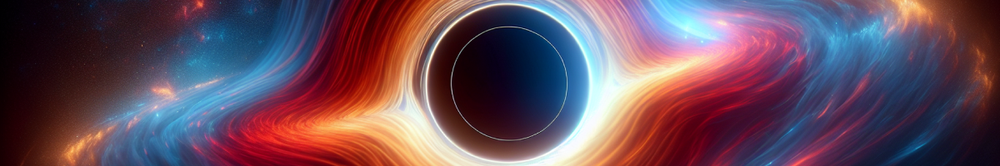

<h1 align="center">Plasma</h1>

A _very_ lightweight Steam headless implementation.



## Motivation
In short, I wanted to play KSP without installing it in my personal machine.

I was a heavy user of shadow.tech, until it became more expensive and I could not
justify the monthly cost.

Since then, I started homelabbing, and managed to get a Nvidia Quadro P400 for €20, which should run KSP.
Since I'm homelabbing, my setup does not have a screen, so here we are.

### Alternative solutions
#### josh5/steam-headless
In short: could not get it to work in ~45 minutes. At the time of writing (May 2025) the latest Docker Hub
and GitHub releases are from 2023, and mirror images had basic errors of file corruption.

#### linuxserver/steam
The last "nivida commit" is not hopeful. I did not even try the image out.

#### Main differences

The main differences with these projects is that this project is not trying
to work "easily" for everyone. This is for targeted setups (headless, nvidia)
but should work a lot more often.

For example, the Nvidia Docker images come with drivers pre-installed (and you
can build your own) to prevent any driver installation issues when executing
the containers. This also allows container boot to be faster.

## Shoutouts
- Lizardbyte (Sunshine)
	- [Sunshine dockerfile](https://github.com/LizardByte/Sunshine/blob/c6f36474ba9b492eea2a60930ca7304ea96176af/docker/debian-bookworm.dockerfile)
- Josh5 (Steam-headless)
	- [Steam-headless Dockerfile](https://github.com/Steam-Headless/docker-steam-headless/blob/14c770bce61db99c56592760c73c2ba454dab648/Dockerfile.debian#L1)
- keylase (NVENC and NvFBC patches)
	- And enourmous shoutout to `vojtad` for commit [95dd542](https://github.com/keylase/nvidia-patch/commit/95dd542a8014578f91ffdd864a37b67b19c8948e) allowing us to pass driver version manually
- e-dong (Virtual display Guide)
	- Virtual display guide Reddit
	- [Virtual display docs Sunshine](https://app.lizardbyte.dev/2023-09-14-remote-ssh-headless-sunshine-setup/?lng=en-US#virtual-display-setup)


## Getting Started

### Intel/AMD Graphic Cards
No idea if this works. Most guides seem to suggest that Intel and AMD
cards work a lot better/easier than Nvidia. Let me know!

### Nvidia Graphic Cards
This project releases an Nivida-only image with 

#### Test command (Docker)
```sh
sudo docker run -it --rm \
	--entrypoint bash \
	--runtime=nvidia  \
	--gpus all \
	-v /dev/input:/dev/input \
	-v /dev/uinput:/dev/uinput \
	-v /dev/dri:/dev/dri \
	--cap-add SYS_ADMIN \
	-p 47984-47990:47984-47990/tcp \
	-p 48010:48010 \
	-p 47998-48000:47998-48000/udp \
	plasma:nvidia-570-test
```

## Docs

Check the GitHub wiki

